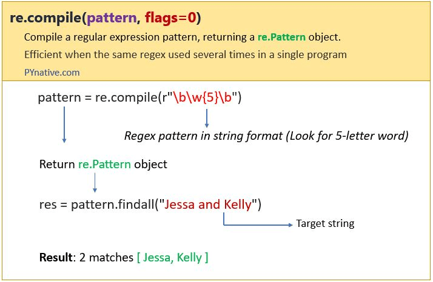

# regex

- create

  - `re.compile()`

  

- operate

  - `re.search()`
  - `re.match()`
  - `re.findall()`
  - `re.finditer()`
  - `re.split()`
  - `re.sub()`
  - `re.subn()`

    |     功能      |                                         说明                                         |                                             举例                                             |
    | :-----------: | :----------------------------------------------------------------------------------: | :------------------------------------------------------------------------------------------: |
    |  re.search()  |                       扫描查找整个字符串，找到第一个模式匹配的                       |                            re.search(rrun, I run to you) > 'run'                             |
    |  re.match()   | 从字符的最开头匹配，找到第一个模式匹配的即使用 re.M 多行匹配，也是从最最开头开始匹配 |                             re.match(rrun, I run to you) > None                              |
    | re.findall()  |                         返回一个不重复的 pattern 的匹配列表                          |              re.findall(rr[ua]n, I run to you. you ran to him) > ['run', 'ran']              |
    | re.finditer() |                       和 findall 一样，只是用迭代器的方式使用                        |               for item in re.finditer(rr[ua]n, I run to you. you ran to him):                |
    |  re.split()   |                                   用正则分开字符串                                   |     re.split(rr[ua]n, I run to you. you ran to him) > ['I ', ' to you. you ', ' to him']     |
    |   re.sub()    |                                    用正则替换字符                                    |    re.sub(rr[ua]n, jump, I run to you. you ran to him) > 'I jump to you. you jump to him'    |
    |   re.subn()   |                          和 sub 一样，额外返回一个替代次数                           | re.subn(rr[ua]n, jump, I run to you. you ran to him) > ('I jump to you. you jump to him', 2) |

## unicode

```py
print(re.search(r"不?爱", "我爱你"))
print(re.search(r"不?爱", "我不爱你"))
print(re.search(r"不.*?爱", "我不是很爱你"))
```

## 多模式匹配

| 模式 |     全称      |                                                说明                                                |
| :--: | :-----------: | :------------------------------------------------------------------------------------------------: |
| re.I | re.IGNORECASE |                                             忽略大小写                                             |
| re.M | re.MULTILINE  |                                    多行模式，改变'^'和'$'的行为                                    |
| re.S |   re.DOTALL   |                        点任意匹配模式，改变'.'的行为, 使".“可以匹配任意字符                        |
| re.L |   re.LOCALE   |                         使预定字符类 \w \W \b \B \s \S 取决于当前区域设定                          |
| re.U |  re.UNICODE   |                 使预定字符类 \w \W \b \B \s \S \d \D 取决于 unicode 定义的字符属性                 |
| re.X |  re.VERBOSE   | 详细模式。这个模式下正则表达式可以是多行，忽略空白字符，并可以加入注释。以下两个正则表达式是等价的 |

## effective

```py
import time
n = 1000000
# 不提前 compile
t0 = time.time()
for _ in range(n):
    re.search(r"ran", "I ran to you")
t1 = time.time()
print("不提前 compile 运行时间：", t1-t0)

# 先做 compile
ptn = re.compile(r"ran")
for _ in range(n):
    ptn.search("I ran to you")
print("提前 compile 运行时间：", time.time()-t1)
```

> 觉得函数式编程不错: `pattern` -> `[str]`

## reference

- [Python Compile Regex Pattern using re.compile()](https://pynative.com/python-regex-compile/)
